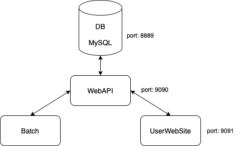

# Projet 7

# Formation "Développeur d'application JAVA", OpenClassrooms.

	Création d'un site de gestion de bibliothèque de la ville.

## Le projet :

**Le site web** 
Le but est de permettre aux usagers de suivre les prêts de leur ouvrages à travers une
interface web:
* Rechercher des ouvrages et voir le nombre d'exemplaire disponible.
* Consulter leurs prêts en cours.
* Le prêt d'un ouvrage est prolongeable une seule fois.
  La prolongation ajoute une nouvelle période de prêt(4 semaines) à la période initiale.

**Un batch** 
Ce logiciel pour le traitement automatisé permettra d'envoyer des mails de relance
aux usagers n'ayant pas rendu les livres en fin de période de prêt. L'envoi sera automatique
à la fréquence d'un par jour.

**L'API web** 
Le site web ainsi que le batch communiqueront avec ce logiciel en REST afin de connaitre
les informations liées à la base de donnée.

## Les contraintes fonctionnelles

	- Application web avec un framework MVC.
	- API web en microservices REST (Les clients (site web, batch) communiqueront avec cette API web) 
		-> factorisation de la logique métier.
	- Packaging avec Maven.

## Développement

	Cette application a été développée avec :
	- Intellij IDEA
	- Java 12
	- Tomcat 9
	- MySQL 8
	- Spring Boot 2.4

L'application a été développée suivant une architecture à microservices :

La partie WebAPI étant développé avec Spring Boot et Spring Security :

## Déploiement

1- Créez une base de données nommée `virtualbookcase`.

2- À la racine du projet, exécutez `mvn clean package` pour générer le fichier JAR dans le dossier `target` de chaque sous-projet :
  * `./WebAPI/target/VirtualBookcaseWebAPI-1.0.0.jar`
  * `./UserWebSite/target/VirtualBookcaseUserWebSite-1.0.0.jar`
  * `./Batch/target/VirtualBookcaseBatch-1.0.0.jar`

3- Lancez les fichiers JARs :
  * `java -jar ./WebAPI/target/VirtualBookcaseWebAPI-1.0.0.jar`
  * `java -jar ./UserWebSite/target/VirtualBookcaseUserWebSite-1.0.0.jar`
  * `java -jar ./Batch/target/VirtualBookcaseBatch-1.0.0.jar`

`VirtualBookcaseWebAPI-1.0.0.jar` admet les paramètres suivants :
  * `--MYSQL_HOST=<localhost>`
  * `--MYSQL_PORT=<8889>`
  * `--MYSQL_DBNAME=<virtualbookcase>`
  * `--MYSQL_USERNAME=<root>`
  * `--MYSQL_PASSWORD=<root>`

  * `--JWT_SECRET=<asdfSFS34wfsdfsdfSDSD32dfsddDDerQSNCK34SOWEK5354fdgdf4>`
  * `--JWT_EXPIRATION_MS=<86400000>`

  * `--SMTP_HOST=<>`
  * `--SMTP_PORT=<>`
  * `--SMTP_MODE=<>` 0 pour SMTP, 1 pour SMTPS et 2 pour SMTP_TLS
  * `--SMTP_USER=<>`
  * `--SMTP_PASS=<>`

`VirtualBookcaseUserWebSite-1.0.0.jar` admet les paramètres suivants :

  * `--JWT_SECRET=<asdfSFS34wfsdfsdfSDSD32dfsddDDerQSNCK34SOWEK5354fdgdf4>`

`VirtualBookcaseBatch-1.0.0.jar` admet les paramètres suivants :

  * `--BATCH_LOGIN=<>`
  * `--BATCH_PASSWORD=<>`

  * `--SMTP_HOST=<>`
  * `--SMTP_PORT=<>`
  * `--SMTP_MODE=<>` 0 pour SMTP, 1 pour SMTPS et 2 pour SMTP_TLS
  * `--SMTP_USER=<>`
  * `--SMTP_PASS=<>`

> Remarque : la notation `<>` indique la valeur par défaut d'un paramètre. 

4- Dans votre navigateur, accédez au site à l'adresse [http://localhost:9091](http://localhost:9091).

## Auteur

Olivier Morlotti